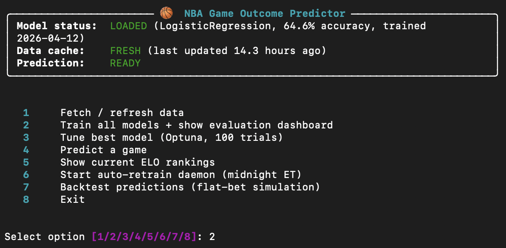
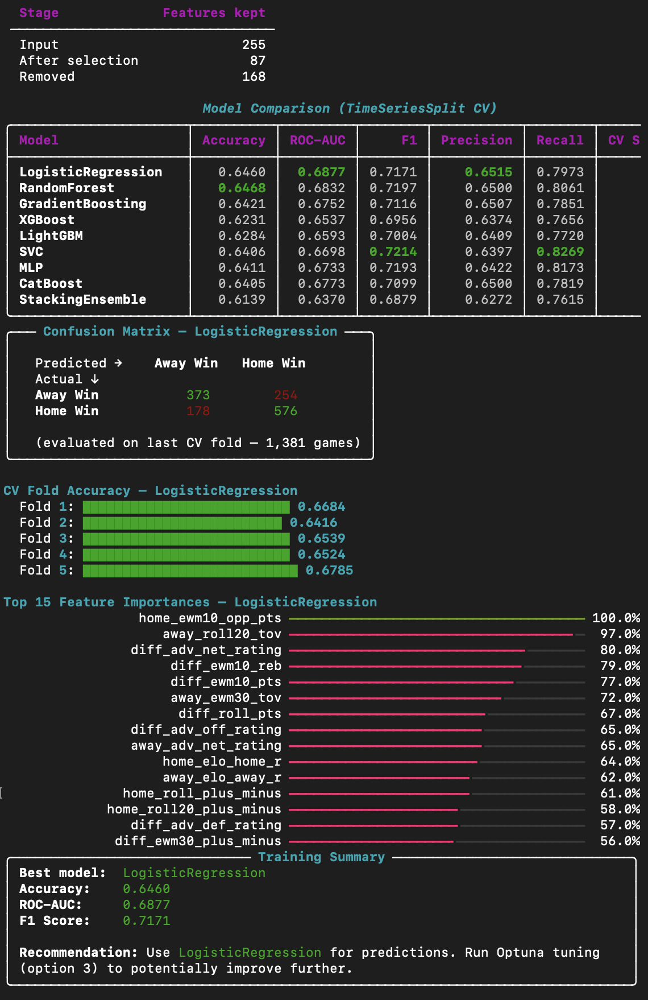
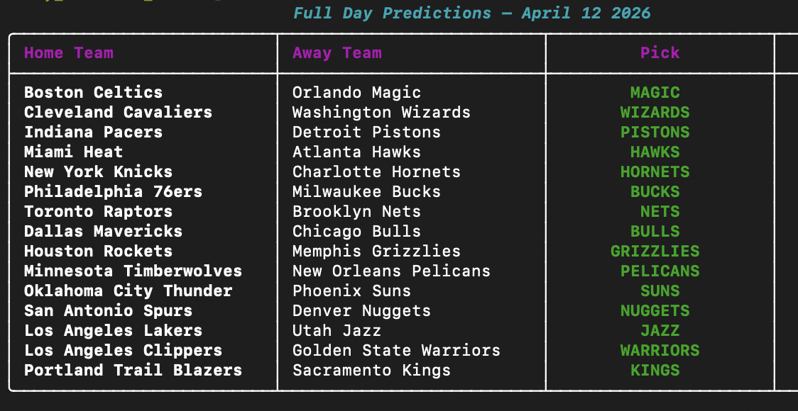
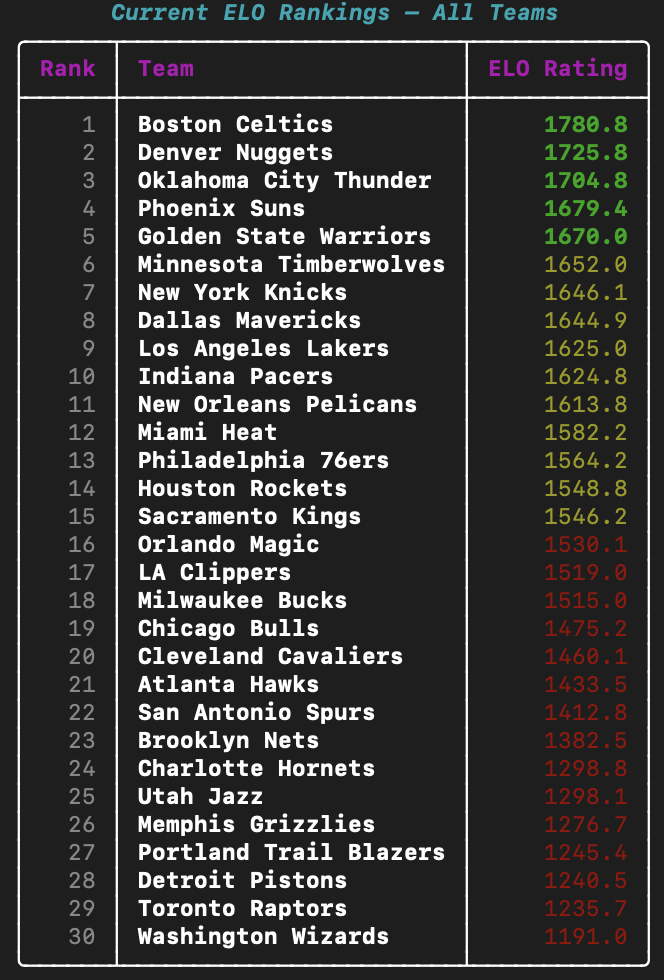

# 🏀 NBA Game Outcome Predictor

A fully terminal-based NBA game predictor powered by machine learning, CARMELO-lite ELO ratings, Vegas odds, advanced stats, and real-time injury data. Trains 9 models (including a stacking ensemble), auto-tunes with Optuna, and runs a flat-bet backtest simulator.

---

## Screenshots

### Main Menu


### Model Training Dashboard


### Game Prediction


### ELO Rankings


---

## Features

| Category | Details |
|---|---|
| **Data** | 7 seasons of NBA game logs via `nba_api`, ESPN injury reports, The Odds API (Vegas lines), LeagueDashTeamStats (advanced) |
| **ELO** | CARMELO-lite with 4 variants (overall, home-specific, away-specific, recent form), MOV K-scaling, season reversion |
| **Features** | 250+ engineered: rolling 5/10/20-game windows, EWM span-10/30, fatigue index, days since last win, clutch win%, travel km, timezone shift, road trip length, Vegas implied probability, advanced ORtg/DRtg/Pace/TS% |
| **Models** | LogisticRegression, RandomForest, GradientBoosting, XGBoost, LightGBM, SVC, MLP, CatBoost, StackingEnsemble (XGBoost meta) |
| **Tuning** | Optuna 300 trials, TPESampler(multivariate=True), MedianPruner |
| **Calibration** | Isotonic regression via CalibratedClassifierCV |
| **Backtest** | Flat-bet simulation at -110 vig, per-season breakdown, confidence band chart |

---

## Project Structure

```
nba_predictor/
├── main.py                  ← Rich interactive CLI (8-option menu)
├── scheduler.py             ← Midnight auto-retrain daemon
├── config.example.json      ← Template — copy to config.json and fill in keys
├── requirements.txt
│
├── data/
│   ├── collector.py         ← nba_api fetch + incremental cache
│   ├── injuries.py          ← ESPN injury report scraper
│   ├── vegas.py             ← The Odds API (moneylines, spreads, totals)
│   ├── players.py           ← LeagueDashPlayerStats (star usage, depth)
│   ├── advanced.py          ← LeagueDashTeamStats Advanced (ORtg/DRtg/Pace)
│   ├── refs.py              ← BoxScoreSummaryV2 referee cache
│   └── cache/               ← CSV cache (git-ignored, rebuilt by option 1)
│
├── features/
│   ├── engineering.py       ← Full feature matrix builder
│   ├── elo.py               ← CARMELO-lite ELO (4 variants)
│   └── schedule.py          ← Travel km, timezone shift, road trip length
│
├── models/
│   ├── trainer.py           ← Trains all 9 models, stacking, calibration
│   ├── evaluator.py         ← Rich evaluation dashboard
│   ├── tuner.py             ← Optuna hyperparameter search
│   ├── backtest.py          ← Flat-bet simulation
│   └── saved/               ← best_model.pkl, scaler.pkl (git-ignored)
│
└── predict/
    └── predictor.py         ← Load model, build live features, SHAP output
```

---

## Setup

### 1. Clone & Install

```bash
git clone https://github.com/s9b/NBA-Predictor.git
cd NBA-Predictor
pip install -r requirements.txt
```

> **Python 3.10+** required.

---

### 2. Get Your API Keys

#### The Odds API (Vegas lines — optional but recommended)

Vegas implied probability is one of the strongest predictive features.

1. Go to **[https://the-odds-api.com](https://the-odds-api.com)**
2. Sign up for a free account (500 requests/month — enough for daily use)
3. Copy your API key from the dashboard

The free tier covers ~16 requests/day. The app shows your remaining quota after each fetch.

---

### 3. Configure

```bash
cp config.example.json config.json
```

Open `config.json` and fill in your key:

```json
{
  "odds_api_key": "YOUR_KEY_HERE",
  "seasons": ["2017-18", "2018-19", "2019-20", "2020-21", "2021-22", "2022-23", "2023-24"]
}
```

> ⚠️ `config.json` is git-ignored — your key will never be committed.

---

### 4. Run

```bash
python main.py
```

---

## First-Time Walkthrough

```
Option 1 → Fetch / refresh data
```
Downloads ~7 seasons of NBA game logs (~5–10 min on first run, incremental after that).
Also fetches advanced stats and today's Vegas odds if your key is set.

```
Option 2 → Train all models
```
Trains 9 models with TimeSeriesSplit CV (~3–5 min). Prints a full comparison dashboard.
The best model (by ROC-AUC) is saved automatically.

```
Option 3 → Tune best model  (optional)
```
Runs 300 Optuna trials to squeeze out extra accuracy (~20–40 min). Skip on first run.

```
Option 4 → Predict today's games
```
Shows today's NBA schedule (auto-fetched). Enter a game number or `0` for all games.
Team names are fuzzy-matched — `"lakers"`, `"LAL"`, `"Los Angeles"` all work.

```
Option 5 → ELO rankings
```
Shows current CARMELO-lite ELO standings across all 30 teams.

```
Option 7 → Backtest
```
Runs a flat-bet simulation on held-out seasons. Shows ROI, win rate, and per-season breakdown.

---

## Menu Reference

| Option | Action | Time |
|---|---|---|
| 1 | Fetch / refresh data | ~1 min (cached) |
| 2 | Train all models | ~3–5 min |
| 3 | Tune with Optuna (300 trials) | ~20–40 min |
| 4 | Predict today's games | instant |
| 5 | ELO rankings | instant |
| 6 | Start auto-retrain daemon | runs nightly |
| 7 | Backtest flat-bet simulation | ~30 sec |
| 8 | Exit | — |

---

## Models & Typical Performance

| Model | Accuracy | ROC-AUC |
|---|---|---|
| LogisticRegression | ~64–65% | ~0.68–0.69 |
| RandomForest | ~64–65% | ~0.68–0.70 |
| GradientBoosting | ~64% | ~0.67–0.69 |
| XGBoost | ~62–64% | ~0.65–0.68 |
| LightGBM | ~63–64% | ~0.66–0.68 |
| SVC | ~64% | ~0.67–0.68 |
| MLP | ~64% | ~0.67–0.68 |
| CatBoost | ~64% | ~0.67–0.68 |
| StackingEnsemble | ~61–63% | ~0.63–0.66 |

> NBA outcomes have an inherent noise ceiling (~70–72% for any feature-based model). Logistic Regression consistently tops this leaderboard — a well-calibrated linear boundary outperforms complex models on noisy sports data.

---

## Auto-Retrain Daemon

`scheduler.py` runs nightly at **12:00 AM ET**:
- Fetches only new games since last run (incremental)
- Updates ELO ratings
- Retrains all models
- Replaces saved model only if new ROC-AUC ≥ current

Start from the menu (**option 6**) or directly:

```bash
python scheduler.py           # Rich live panel
python scheduler.py --headless  # plain logs (CI/server mode)
```

---

## Data Sources

| Source | What it provides | Cost |
|---|---|---|
| `nba_api` | Game logs, rosters, advanced stats | Free |
| ESPN | Injury reports (scraped) | Free |
| [The Odds API](https://the-odds-api.com) | Vegas moneylines, spreads, totals | Free (500 req/mo) |

---

## License

MIT
